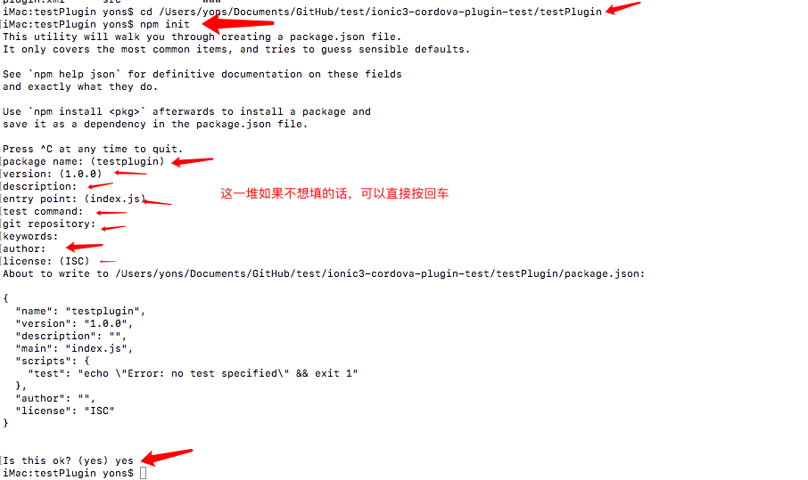

### 文件目录介绍

* testPlugin：自定义插件工程
* testIonic：ionic项目，用于测试testPlugin插件

### 新建插件

````
  在终端执行：
  plugman create --name testPlugin --plugin_id com.xjt.testPlugin --plugin_version 1.0.0
  
  说明:
    --name testPlugin //自定义插件名称
    --plugin_id com.xjt.testPlugin //自定义插件的包名
    --plugin_version 1.0.0 //自定义插件版本
  
  如果没有安装plugman，需要先执行:npm install -g plugman
````

### 给插件添加平台

* cd到插件对应的根目录
* 在根目录执行：plugman platform add --platform_name android

````
  cd testPlugin
  plugman platform add --platform_name android 
````

执行完上面命令以后，就会生成src/android、www文件夹下面生成Android模板代码与JS接口代码，Android代码如下：

````
package com.xjt.testPlugin;

import org.apache.cordova.CordovaPlugin;
import org.apache.cordova.CallbackContext;

import org.json.JSONArray;
import org.json.JSONException;
import org.json.JSONObject;

/**
 * This class echoes a string called from JavaScript.
 */
public class testPlugin extends CordovaPlugin {

    /**
    *  action:JS调用的方法名称,用来判断执行哪个方法
    *  args:JS传过来的参数
    *  callbackContext：用于向JS返回执行结果
    **/
    @Override
    public boolean execute(String action, JSONArray args, CallbackContext callbackContext) throws JSONException {
        if (action.equals("coolMethod")) {//action表示JS调用的方法名称
            String message = args.getString(0);
            this.coolMethod(message, callbackContext);
            return true;
        }
        return false;
    }

    private void coolMethod(String message, CallbackContext callbackContext) {
        if (message != null && message.length() > 0) {
            callbackContext.success(message);
        } else {
            callbackContext.error("Expected one non-empty string argument.");
        }
    }
}
````

www目录下面的JS代码：

````
var exec = require('cordova/exec');

exports.coolMethod = function (arg0, success, error) {
    /**
    *  success:调用成功回调 
    *  error:调用失败的回调 
    *  testPlugin：插件名
    *  coolMethod：要调用的Android或iOS方法名. 对应Android中execute中的action名称
    *  arg0：向Android或iOS传递的参数
    **/
    exec(success, error, 'testPlugin', 'coolMethod', [arg0]);
};
````

### 配置plugin.xml文件：
这一步最关键，因为在这个文件里面配置了Android项目需要的源代码文件、权限、资源文件、图片等。如果这一步配置错了，后面会导致原生项目编译无法通过。比如这里的plugin.xml:
  
````
<?xml version="1.0" encoding="utf-8"?>

<!--id:插件的标识，即发布安装到plugin的ID，这个ID应该是唯一的-->
<plugin xmlns="http://apache.org/cordova/ns/plugins/1.0" xmlns:android="http://schemas.android.com/apk/res/android" id="com.xjt.testPlugin" version="1.0.0">
    <name>testPlugin</name><!--插件的名称-->
    <js-module name="testPlugin" src="www/testPlugin.js"><!--对应的JS文件-->
        <clobbers target="cordova.plugins.testPlugin"/>
        <!--插件在JS中的调用的前缀，调用的时候应该写成：cordova.plugins.testPlugin.方法名 -->
        <!--如果将上面的target配置为xjtPlugin，在JS中应该这样调用：xjtPlugin.方法名  -->
    </js-module>
    
    <platform name="android"><!--Android平台配置-->
        <config-file parent="/*" target="res/xml/config.xml">
            <feature name="testPlugin">
                <param name="android-package" value="com.xjt.testPlugin.testPlugin"/>
            </feature>
        </config-file>
        <config-file parent="/*" target="AndroidManifest.xml"/>
        <source-file src="src/android/testPlugin.java" target-dir="src/com/xjt/testPlugin/testPlugin"/><!--配置源文件-->
    </platform>
</plugin>

````


### 初始化package.json

我们开的插件，最终需要提供给别人安装使用的，因此插件必须包含package.json,生成package.json方法如下：


````
  1,cd 到插件目录
  2，npm init
````

------

### ionic项目中测试插件  [ts文件](testIonic3/src/pages/home/home.ts)  [Java文件](testPlugin/src/android/testPlugin.java)

````
  1,新建项目：
      ionic start testIonic3 tabs
  2,cd到ionic项目根目录    
  3,安装插件
      ionic cordova plugin add 插件目录
  4，调用插件
       import { Component } from '@angular/core';
		import { NavController } from 'ionic-angular';
		declare let cordova: any;//引入
		@Component({
		  selector: 'page-home',
		  templateUrl: 'home.html'
		})
		export class HomePage {
		
		  ....
	    cordova.plugins.TestPlugin.coolMethod("向原生传递的参数",
	      result => {
	        alert(result)
	      },
	      error => {
	        alert(error)
	      });
		  ....
		}    
````


